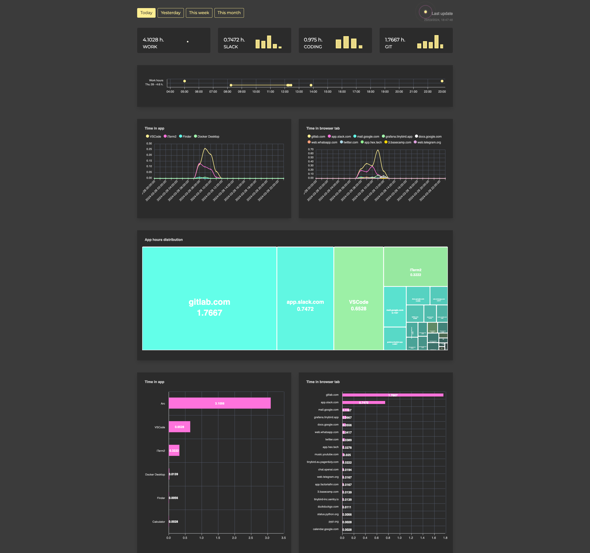
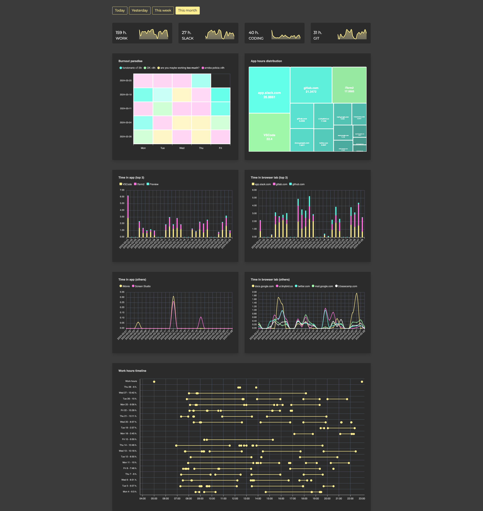

This repo contains a shell script to monitor how I use my computer and improve my productivity.

It contains two scripts:

- aa.sh: To be executed as a daemon to collect traces
- hr.py: To clock-in/clock-out to FactorialHR. I don't have access to my orgs authentication secrets so it uses Selenium to log in and get a cookie session for the API.

I built this script for myself, I don't expect to work on any other computer than mine. You can try to tweak it to your needs if you want.

aa.sh uses:
- yabai: to get the current desktop
- ddcctl: to check if external monitors are on or off
- python: to run hr.py (clock-in/out to FactorialHR)
- curl: To send traces to a Tinybird Data Source
- osascript: to get the current application and browser tab (Arc) used

The script sents a trace to Tinybird every 10 seconds indicating:
- if the external monitors are 'locked' or 'unlocked'
- the current active desktop space: 'personal' or 'work'
- the active_app, active_domain and url
- it clocks-in to FactorialHR when the monitors are unlocked and clocks-out when they are off

www.tinybird.co is used to build an analytical dashboard. The Tinybird project is not provided (yet).

With the traces sent I can get a view of my work patterns at different granularities.

